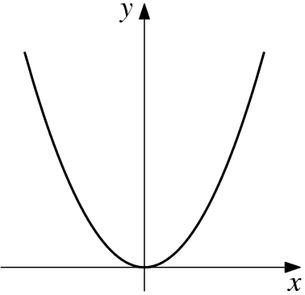
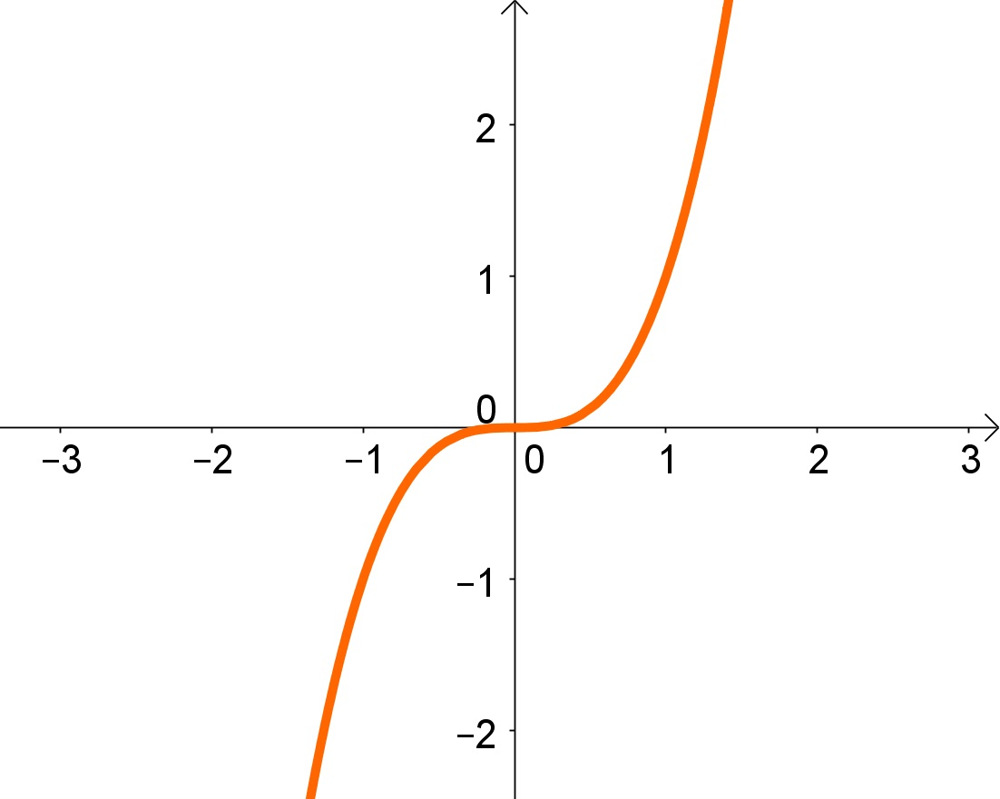
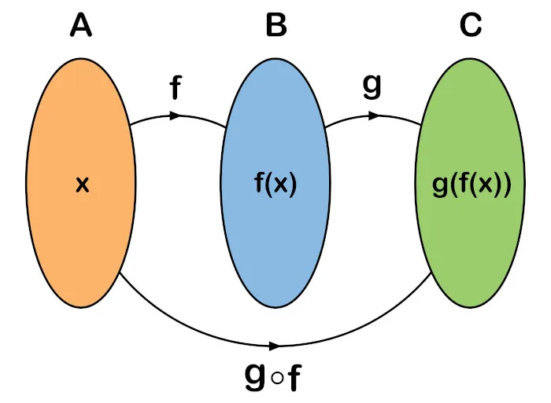
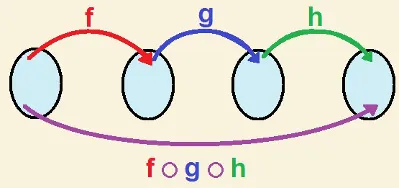

# Cálculo Básico

## Table of Contents
- [Cálculo Básico](#cálculo-básico)
  - [Table of Contents](#table-of-contents)
  - [Produto Cartesiano](#produto-cartesiano)
  - [Relações](#relações)
  - [Funções](#funções)
  - [Definição de uma função](#definição-de-uma-função)
  - [Imagem de uma função](#imagem-de-uma-função)
  - [Tipos de imagem de uma função](#tipos-de-imagem-de-uma-função)
    - [Função Injetora](#função-injetora)
    - [Função Sobrejetora](#função-sobrejetora)
    - [Função Bijetora](#função-bijetora)
    - [Função Não Injetora/Não Sobrejetora](#função-não-injetoranão-sobrejetora)
  - [Expressão funcional](#expressão-funcional)
  - [Gráficos](#gráficos)
  - [Paridade](#paridade)
    - [Função Par](#função-par)
    - [Função Ímpar](#função-ímpar)
    - [Função Não Par nem Ímpar](#função-não-par-nem-ímpar)
  - [Função Inversa](#função-inversa)
  - [Composição de Funções](#composição-de-funções)
  - [Tipos de funções](#tipos-de-funções)
    - [Função Constante](#função-constante)
    - [Função Linear](#função-linear)
    - [Função Quadrática](#função-quadrática)
    - [Função Exponencial](#função-exponencial)
    - [Função Logarítmica](#função-logarítmica)
    - [Função Trigonométrica](#função-trigonométrica)
    - [Função Polinomial](#função-polinomial)
    - [Função Racional](#função-racional)
    - [Função Sigmoide](#função-sigmoide)
  - [Limites](#limites)
    - [Limite Finito](#limite-finito)
    - [Limite Infinito](#limite-infinito)
    - [Limite Lateral](#limite-lateral)
    - [Limite no Infinito](#limite-no-infinito)
  - [Derivadas](#derivadas)
    - [Formas de derivação](#formas-de-derivação)
      - [Derivação de Potência (Regra do tombo)](#derivação-de-potência-regra-do-tombo)
      - [Derivação de exponenciais](#derivação-de-exponenciais)
      - [Derivação de logarítmicos](#derivação-de-logarítmicos)
      - [Derivação de trigonométricos](#derivação-de-trigonométricos)
        - [Derivada do seno (sin(x))](#derivada-do-seno-sinx)
        - [Derivada do cosseno (cos(x))](#derivada-do-cosseno-cosx)
        - [Derivada da tangente (tan(x))](#derivada-da-tangente-tanx)
        - [Derivada da cotangente (cot(x))](#derivada-da-cotangente-cotx)
    - [Regras de derivadas](#regras-de-derivadas)
      - [Regra da Soma e Diferença](#regra-da-soma-e-diferença)
      - [Regra do Produto](#regra-do-produto)
      - [Regra do Quociente](#regra-do-quociente)
      - [Regra da Cadeia](#regra-da-cadeia)
    - [Inclinação da reta tângente](#inclinação-da-reta-tângente)
    - [Derivadas de segunda ordem](#derivadas-de-segunda-ordem)

## Produto Cartesiano
O produto cartesiano é uma operação que envolve dois conjuntos e resulta em um conjunto de pares ordenados. Dados dois conjuntos A e B, o produto cartesiano entre eles, denotado por A × B, é o conjunto de todas as possíveis combinações de um elemento de A com um elemento de B. Cada par ordenado (a, b), onde a pertence a A e b pertence a B, está presente no produto cartesiano. 

Por exemplo, se **A = {1, 2}** e **B = {a, b}**, então o produto cartesiano: 

**A × B** = **{(1, a), (1, b), (2, a), (2, b)}**

## Relações
Uma relação é uma conexão ou associação entre elementos de dois conjuntos. Ela descreve a forma como os elementos de um conjunto estão relacionados aos elementos de outro conjunto. Uma relação pode ser representada como um conjunto de pares ordenados, onde cada par (a, b) indica que o elemento a está relacionado ao elemento b. Por exemplo, em um conjunto de alunos e um conjunto de disciplinas, uma relação pode ser estabelecida para indicar quais alunos estão matriculados em quais disciplinas. Essa relação pode ser representada por meio de pares ordenados, onde cada par (aluno, disciplina) representa a matrícula de um aluno em uma disciplina específica. As relações podem ser estudadas em várias áreas da matemática, como álgebra, teoria dos conjuntos, teoria dos grafos e análise de dados.

## Funções
Uma função é um tipo especial de relação que associa cada elemento de um conjunto, chamado de domínio, a um único elemento de outro conjunto, chamado de contradomínio. Em outras palavras, uma função mapeia elementos de um conjunto de partida para um conjunto de chegada. Cada elemento do domínio tem exatamente um correspondente no contradomínio. Uma função é geralmente representada por uma regra ou fórmula que descreve como os elementos do domínio são transformados para obter os elementos do contradomínio. Por exemplo, a função **f(x) = 2x** representa uma função que multiplica cada número x por 2. Neste caso, o conjunto de partida é o conjunto dos números reais e o conjunto de chegada também é o conjunto dos números reais. As funções são amplamente utilizadas em matemática, ciência da computação, física e outras áreas para modelar relações e transformações entre conjuntos.

## Definição de uma função
Uma função é uma relação matemática que associa cada elemento de um conjunto de partida, chamado de domínio, a um único elemento de um conjunto de chegada, chamado de contradomínio. Formalmente, uma função f é definida como um conjunto de pares ordenados (x, y), onde x é um elemento do domínio e y é um elemento do contradomínio, e para cada x, há apenas um y correspondente. A função é geralmente denotada por f(x) = y, indicando que o valor y é obtido aplicando-se a função f ao valor x.

## Imagem de uma função
A imagem de uma função é o conjunto de todos os valores possíveis de saída, ou seja, todos os elementos do contradomínio que são obtidos ao aplicar a função a elementos do domínio. Em outras palavras, a imagem é o conjunto de todos os valores y que podem ser gerados pela função f(x). É denotada como Im(f) ou f(D), onde D é o domínio da função. Nem todos os elementos do contradomínio podem ser alcançados pela função, então a imagem é um subconjunto do contradomínio.

## Tipos de imagem de uma função
Existem vários tipos função, dependendo de suas propriedades. Alguns dos tipos comuns incluem:

### Função Injetora

Também conhecida como função unívoca ou injetiva, é aquela em que cada elemento do domínio é mapeado para um único elemento no contradomínio. Em outras palavras, não há dois elementos diferentes do domínio que são mapeados para o mesmo elemento no contradomínio.

### Função Sobrejetora

Também conhecida como função sobrejetiva, é aquela em que cada elemento do contradomínio possui pelo menos um elemento correspondente no domínio. Em outras palavras, a função "cobre" todo o contradomínio, não deixando nenhum elemento sem correspondência.

### Função Bijetora

Também conhecida como função biunívoca ou bijetiva, é uma função que é tanto injetora quanto sobrejetora. Ela associa cada elemento do domínio a um único elemento do contradomínio, e cada elemento do contradomínio tem um único elemento correspondente no domínio.

Funções quadraticas podem se caracterizar como bijetoras. 

Exemplo:

f(x) = x^2
f(2) = (2)^2 = 4
f(-2) = (-2)^2 = 4

### Função Não Injetora/Não Sobrejetora

Uma função que não é injetora nem sobrejetora é chamada de não injetora/não sobrejetora. Isso significa que existem elementos no domínio que são mapeados para o mesmo elemento no contradomínio e/ou que existem elementos no contradomínio sem correspondência no domínio.

## Expressão funcional

Uma expressão funcional é uma representação matemática que descreve como uma função é definida em termos de suas variáveis independentes e possíveis operações matemáticas. Ela fornece uma fórmula ou uma maneira de calcular o valor da função para diferentes valores de entrada. Por exemplo, a expressão funcional da função f(x) = 2x + 1 é uma fórmula que relaciona a variável x ao valor correspondente de f(x). Nesse caso, a expressão funcional é 2x + 1, indicando que a função dobra o valor de x, adiciona 1 e retorna o resultado.

## Gráficos
Um gráfico é uma representação visual de uma função ou de uma relação matemática. Ele exibe a relação entre os valores das variáveis independentes e dependentes da função. Em um gráfico, o eixo horizontal (eixo x) geralmente representa a variável independente, enquanto o eixo vertical (eixo y) representa a variável dependente. Os pontos do gráfico são plotados com base nos pares ordenados (x, y) que representam os valores da função. Os gráficos são úteis para visualizar a tendência, comportamento e padrões da função, permitindo uma compreensão mais intuitiva de seu comportamento.

## Paridade
O conceito de paridade está relacionado à propriedade de uma função em relação à inversão de seus valores quando a variável independente é substituída pelo seu oposto. Uma função pode ser classificada como par, ímpar ou não par nem ímpar, com base nessa propriedade.

### Função Par

Uma função é par se, para qualquer valor x, f(x) = f(-x). Em outras palavras, ela possui simetria em relação ao eixo vertical. Seu gráfico é simétrico em relação ao eixo y. Por exemplo, a função f(x) = x² é uma função par, pois f(x) = f(-x) para qualquer valor de x.

### Função Ímpar

Uma função é ímpar se, para qualquer valor x, f(x) = -f(-x). Isso significa que a função exibe uma simetria em relação à origem do sistema de coordenadas. Seu gráfico é simétrico em relação à origem. Por exemplo, a função f(x) = x³ é uma função ímpar, pois f(x) = -f(-x) para qualquer valor de x.

### Função Não Par nem Ímpar

Se uma função não satisfaz nenhuma das condições anteriores, ela é considerada não par nem ímpar. Isso significa que não há uma simetria específica em relação ao eixo y ou à origem. Por exemplo, a função f(x) = x + 1 não é par nem ímpar, pois não satisfaz as propriedades de uma função par ou ímpar.

A paridade é uma propriedade importante das funções que pode ajudar a simplificar cálculos e análises matemáticas, além de fornecer informações sobre a simetria e comportamento das funções.

## Função Inversa

A função inversa é uma função que "desfaz" a operação de uma função original. Seja f uma função que associa cada elemento x do seu domínio a um elemento y no seu contradomínio. A função inversa de f, denotada por f⁻¹, é tal que f⁻¹(y) = x, onde x é o elemento correspondente a y no domínio de f. Em outras palavras, a função inversa mapeia os valores de saída da função original de volta aos valores de entrada correspondentes.

Para que uma função tenha uma função inversa, ela deve ser injetora, ou seja, cada valor de entrada deve ter um único valor de saída correspondente. 

Além disso, a função original e sua inversa devem ser mutuamente reversíveis, o que significa que a aplicação da função original seguida pela função inversa deve resultar na identidade, e a aplicação da função inversa seguida pela função original também deve resultar na identidade.

## Composição de Funções

A composição de funções é uma operação que combina duas funções em uma única função. Seja f uma função que mapeia elementos do domínio A para o contradomínio B, e seja g uma função que mapeia elementos do domínio B para o contradomínio C. A composição de f e g, denotada por g(f(x)), é uma nova função que primeiro aplica f a um elemento x do domínio A e, em seguida, aplica g ao resultado obtido para obter o valor final no contradomínio C.

Para calcular a composição de funções, substituímos o resultado da função f no lugar da variável de entrada de g. Em outras palavras, g(f(x)) = g(y), onde y = f(x). Isso permite que as funções sejam combinadas de forma sequencial, onde a saída de uma função se torna a entrada da outra função.

É importante observar que a ordem da composição das funções importa. Em geral, g(f(x)) não é o mesmo que f(g(x)), a menos que f e g sejam funções inversas. A composição de funções é uma operação fundamental na matemática e é usada para modelar transformações sequenciais e relações entre conjuntos.

## Tipos de funções

### Função Constante

Uma função constante é aquela em que o valor da função é o mesmo para todos os valores do domínio. Sua expressão funcional é f(x) = c, onde "c" é uma constante real. O gráfico de uma função constante é uma linha reta paralela ao eixo x, em que a altura da linha é igual a c. A função constante é usada para representar quantidades fixas e invariáveis em problemas matemáticos e científicos.

### Função Linear

Uma função linear é uma função polinomial de grau 1, ou seja, sua expressão funcional é da forma f(x) = mx + b, onde m e b são constantes reais. O gráfico de uma função linear é uma linha reta. A taxa de variação da função é constante, o que significa que a cada incremento unitário no valor de x, o valor de y aumenta ou diminui pela mesma quantidade.

### Função Quadrática

Uma função quadrática é uma função polinomial de grau 2. Sua expressão funcional é da forma f(x) = ax² + bx + c, onde a, b e c são constantes reais e a ≠ 0. O gráfico de uma função quadrática é uma parábola. A forma da parábola depende do valor de a: se a > 0, a parábola abre para cima, e se a < 0, a parábola abre para baixo.

### Função Exponencial

Uma função exponencial é uma função em que a variável independente aparece no expoente. Sua expressão funcional é da forma f(x) = a^x, onde a é uma constante real positiva. O gráfico de uma função exponencial é uma curva que pode crescer rapidamente ou decair rapidamente, dependendo do valor de a.

### Função Logarítmica

Uma função logarítmica é a função inversa de uma função exponencial. Sua expressão funcional é da forma f(x) = logₐ(x), onde a é a base do logaritmo e x é um número real positivo. O gráfico de uma função logarítmica é uma curva que cresce lentamente ou decai lentamente à medida que x aumenta.

### Função Trigonométrica

As funções trigonométricas estão relacionadas aos triângulos e aos ângulos. Alguns exemplos comuns de funções trigonométricas incluem a função seno (sin(x)), a função cosseno (cos(x)) e a função tangente (tan(x)). Essas funções possuem propriedades periódicas e seus gráficos se repetem ao longo de um intervalo específico.

### Função Polinomial

Uma função polinomial é uma função formada por uma expressão polinomial envolvendo a variável independente x. Sua expressão funcional é da forma f(x) = aₙxⁿ + aₙ₋₁xⁿ⁻¹ + ... + a₁x + a₀, onde os coeficientes aₙ, aₙ₋₁, ..., a₁, a₀ são constantes reais e n é um número natural. O grau da função polinomial é dado pelo maior expoente da variável x. O gráfico de uma função polinomial pode assumir várias formas, como uma linha reta, uma curva suave ou uma curva mais complexa, dependendo do grau e dos coeficientes da função.

### Função Racional

Uma função racional é uma função que é o quociente de dois polinômios. Sua expressão funcional é da forma f(x) = P(x) / Q(x), onde P(x) e Q(x) são polinômios, e Q(x) não é identicamente igual a zero. O domínio de uma função racional é o conjunto de todos os valores de x para os quais o denominador Q(x) é diferente de zero. O gráfico de uma função racional pode apresentar características como assíntotas verticais e horizontais, pontos de descontinuidade e curvas mais complexas.

### Função Sigmoide

A função sigmoide é uma função matemática que possui uma curva em forma de "S". Ela é frequentemente utilizada em problemas de classificação, aprendizado de máquina e redes neurais. A função sigmoide transforma um valor de entrada em um valor compreendido entre 0 e 1.

A expressão funcional da função sigmoide é geralmente representada por f(x) = 1 / (1 + e^(-x)), onde e é a base do logaritmo natural. O gráfico da função sigmoide começa próximo a 0 quando x tende ao menos infinito negativo, aumenta gradualmente à medida que x se aproxima de 0 e se aproxima de 1 quando x tende ao mais infinito positivo.

## Limites 

Na matemática, o conceito de limite é fundamental para entender o comportamento de uma função à medida que a variável independente se aproxima de um determinado valor. O limite descreve o comportamento da função em pontos próximos a um determinado ponto, mesmo que a função não esteja definida exatamente nesse ponto.

Formalmente, podemos dizer que o limite de uma função f(x) quando x se aproxima de um valor a é representado por:

lim(x → a) f(x) = L,

onde L é o valor que f(x) se aproxima à medida que x se aproxima de a. Isso significa que à medida que x se torna cada vez mais próximo de a (mas não igual a a), a função f(x) se aproxima de L.

Para calcular limites, podemos utilizar diferentes métodos, como simplificação algébrica, raciocínio lógico, regras de limites, uso de L'Hôpital, entre outros.

Os limites são amplamente utilizados em cálculo diferencial e integral, análise matemática e em várias outras áreas da matemática. Eles permitem analisar o comportamento das funções em pontos críticos, identificar assíntotas, determinar a continuidade das funções e resolver problemas de otimização, entre outras aplicações.

Existem diferentes tipos de limites que podemos considerar:

### Limite Finito

Um limite é considerado finito quando o valor que a função se aproxima é um número real.

### Limite Infinito

Um limite é considerado infinito quando a função se aproxima de infinito ou menos infinito à medida que x se aproxima do ponto específico.

### Limite Lateral

Um limite lateral é quando x se aproxima do ponto a apenas de um lado. Podemos ter um limite pela esquerda (x → a⁻) ou um limite pela direita (x → a⁺).

### Limite no Infinito

Quando x se aproxima do infinito ou menos infinito, podemos estudar o comportamento da função nesse caso. Podemos ter limites finitos ou infinitos no infinito.

## Derivadas

A derivada é um conceito central no cálculo diferencial e descreve a taxa de variação de uma função em relação à sua variável independente. Ela nos permite estudar como uma função muda em um determinado ponto, incluindo informações sobre sua taxa de crescimento, inclinação da curva e pontos críticos.

A derivada de uma função f(x) é denotada por f'(x) ou dy/dx e representa a taxa de variação instantânea da função em relação a x. A derivada é calculada através de um limite e pode ser interpretada geometricamente como o coeficiente angular da reta tangente ao gráfico da função em um ponto específico.

As derivadas têm muitas aplicações na física, economia, engenharia e em várias outras áreas. Elas nos permitem analisar a taxa de mudança de quantidades, encontrar pontos de máximo e mínimo, determinar a concavidade de curvas e resolver problemas de otimização, entre outras aplicações importantes no estudo do comportamento das funções.

Existem diferentes métodos para calcular derivadas, dependendo do tipo de função. Aqui estão algumas regras e propriedades comuns no cálculo de derivadas:

### Formas de derivação
#### Derivação de Potência (Regra do tombo)

A derivada de uma função potência f(x) = x^n é dada por f'(x) = nx^(n-1), onde n é um número real.

#### Derivação de exponenciais

A derivação dos exponenciais afirma que se temos uma função da forma f(x) = a^x, onde "a" é uma constante positiva diferente de 1, então a derivada dessa função é dada por:

f'(x) = a^x * ln(a),

onde ln(a) é o logaritmo natural de a.

Essa derivação implica que a taxa de variação da função exponencial f(x) = a^x é proporcional ao valor da função em cada ponto e é dada pelo produto do valor da função por ln(a). Isso significa que quanto maior o valor de a, mais rápido a função exponencial cresce.

É importante ressaltar que essa derivação se aplica apenas a funções exponenciais na base "a". Se tivermos uma função exponencial na forma f(x) = e^x, onde e é a base do logaritmo natural, a derivada será f'(x) = e^x. Nesse caso, a derivada da função exponencial é a própria função exponencial.

#### Derivação de logarítmicos

A derivação dos logaritmos afirma que se temos uma função da forma f(x) = logₐ(x), onde "a" é uma constante positiva diferente de 1, então a derivada dessa função é dada por:

f'(x) = (1 / (x * ln(a)),

onde ln(a) é o logaritmo natural de a.

Essa derivação nos diz que a taxa de variação da função logarítmica f(x) = logₐ(x) é inversamente proporcional ao valor de x e ao logaritmo natural da base "a". Quanto maior o valor de x, menor será a taxa de variação da função logarítmica.

É importante observar que essa derivação se aplica apenas a funções logarítmicas na base "a". Se tivermos uma função logarítmica natural da forma f(x) = ln(x), a derivada será f'(x) = 1/x. Nesse caso, a derivada da função logarítmica natural é inversamente proporcional ao valor de x.

#### Derivação de trigonométricos

A derivação de funções trigonométricas envolve a determinação das derivadas das funções seno, cosseno, tangente e suas variações trigonométricas. Aqui estão as derivadas dessas funções:

##### Derivada do seno (sin(x))

A derivada do seno de x é dada por:
d/dx(sin(x)) = cos(x)

##### Derivada do cosseno (cos(x))

A derivada do cosseno de x é dada por:
d/dx(cos(x)) = -sin(x)

##### Derivada da tangente (tan(x))

A derivada da tangente de x é dada por:
d/dx(tan(x)) = sec²(x), onde sec(x) é a função secante(1/(cos²(x))).

##### Derivada da cotangente (cot(x))

A derivada da cotangente de x é dada por:
d/dx(cot(x)) = -csc²(x), onde csc(x) é a função cossecante.

### Regras de derivadas
#### Regra da Soma e Diferença

A derivada de uma soma ou diferença de duas funções f(x) + g(x) ou f(x) - g(x) é a soma ou diferença das derivadas individuais de cada função.

#### Regra do Produto

A derivada do produto de duas funções f(x) * g(x) é dada por f'(x) * g(x) + f(x) * g'(x), onde f'(x) e g'(x) são as derivadas das funções individuais.

#### Regra do Quociente

A derivada do quociente de duas funções f(x) / g(x) é dada por (f'(x) * g(x) - f(x) * g'(x)) / g(x)^2, desde que g(x) não seja igual a zero.

#### Regra da Cadeia

A derivada de uma função composta f(g(x)) é dada por f'(g(x)) * g'(x), onde f'(g(x)) é a derivada da função externa e g'(x) é a derivada da função interna.

### Inclinação da reta tângente

A inclinação na reta tangente a uma curva é uma medida da taxa de variação instantânea da função em um ponto específico. No contexto das derivadas, a inclinação da reta tangente é igual ao valor da derivada da função nesse ponto.

Quando encontramos a derivada de uma função em um ponto, estamos calculando a taxa de variação da função naquele ponto, ou seja, o quão rápido a função está mudando naquele instante. Essa taxa de variação é representada pela inclinação da reta tangente.

Se a inclinação da reta tangente for positiva, isso indica que a função está aumentando no ponto considerado. Se a inclinação for negativa, indica que a função está diminuindo. Uma inclinação igual a zero indica um ponto crítico, onde a função tem um máximo ou mínimo local.

### Derivadas de segunda ordem

As derivadas de segunda ordem referem-se às derivadas da derivada de uma função. Em outras palavras, são as derivadas da derivada original. A derivada de primeira ordem nos dá informações sobre a taxa de variação instantânea de uma função, enquanto as derivadas de segunda ordem fornecem informações adicionais sobre a concavidade da função.

A derivada de segunda ordem de uma função f(x) é denotada por f''(x) ou d²y/dx². Essa derivada representa a taxa de variação da taxa de variação da função em relação a x. Ela nos fornece informações sobre como a inclinação da reta tangente à curva da função está mudando em diferentes pontos.

Existem algumas interpretações importantes das derivadas de segunda ordem:

1. Se f''(x) > 0 em um determinado ponto, isso indica que a função está côncava para cima nesse ponto. Isso significa que a curva da função forma uma concavidade voltada para cima, como uma "U".

2. Se f''(x) < 0 em um determinado ponto, isso indica que a função está côncava para baixo nesse ponto. Isso significa que a curva da função forma uma concavidade voltada para baixo, como um "∩".

3. Se f''(x) = 0 em um determinado ponto, isso pode indicar um ponto de inflexão, onde a concavidade da curva muda.

Além disso, as derivadas de segunda ordem também podem ser usadas para encontrar pontos de máximo ou mínimo locais de uma função. Um ponto onde f'(x) = 0 e f''(x) < 0 indica um máximo local, enquanto um ponto onde f'(x) = 0 e f''(x) > 0 indica um mínimo local.

O estudo das derivadas de segunda ordem é útil para analisar a forma geral da curva de uma função, determinar sua concavidade e identificar pontos de inflexão. Essas informações são essenciais para entender o comportamento e as características detalhadas das funções.

