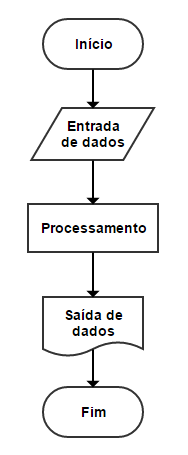

# Algoritmos

## Table of Contents
- [Algoritmos](#algoritmos)
  - [Table of Contents](#table-of-contents)
  - [Definição de algoritmos](#definição-de-algoritmos)
  - [Pseudo códigos](#pseudo-códigos)
  - [Testes de uso](#testes-de-uso)
    - [Definição do caso de teste](#definição-do-caso-de-teste)
    - [Preparação da entrada](#preparação-da-entrada)
    - [Execução do algoritmo](#execução-do-algoritmo)
    - [Verificação dos resultados](#verificação-dos-resultados)
    - [Análise dos resultados](#análise-dos-resultados)
    - [Repetição dos testes](#repetição-dos-testes)
  - [Tipos de dados](#tipos-de-dados)
    - [Números inteiros (int)](#números-inteiros-int)
    - [Números de ponto flutuante (float)](#números-de-ponto-flutuante-float)
    - [Caracteres (char)](#caracteres-char)
    - [Strings (str)](#strings-str)
    - [Booleanos (bool)](#booleanos-bool)
  - [Constantes e vatiáveis](#constantes-e-vatiáveis)
    - [Constantes](#constantes)
    - [Variáveis](#variáveis)
  - [Estruturas de decisão](#estruturas-de-decisão)
    - [Estrutura de decisão simples](#estrutura-de-decisão-simples)
    - [Estrutura de decisão composta](#estrutura-de-decisão-composta)
  - [Estruturas de repetição](#estruturas-de-repetição)
    - [Estrutura de repetição condicional](#estrutura-de-repetição-condicional)
    - [Estrutura de repetição incondicional](#estrutura-de-repetição-incondicional)
  - [Listas e arrays](#listas-e-arrays)
    - [Listas](#listas)
    - [Arrays](#arrays)
  - [Funções](#funções)
  - [Técnicas para melhorar o desempenho do algoritmo](#técnicas-para-melhorar-o-desempenho-do-algoritmo)

## Definição de algoritmos

Algoritmos são uma sequência lógica de passos ou instruções bem definidos que levam à resolução de um problema específico. Eles são usados para representar uma solução clara e precisa para um determinado problema ou tarefa.

Os algoritmos podem ser expressos em diversas formas, como linguagem natural, pseudocódigo ou linguagens de programação. Eles são utilizados em várias áreas, como ciência da computação, matemática, engenharia e outras disciplinas, onde são essenciais para resolver problemas complexos.

Os principais elementos de um algoritmo incluem:

1. Entrada: Os dados ou informações necessários para o algoritmo começar a ser executado.

2. Processamento: As etapas ou operações que devem ser realizadas para transformar a entrada em uma saída desejada. Isso pode incluir cálculos, iterações, condicionais, entre outros.

3. Saída: O resultado obtido após o processamento do algoritmo, que pode ser uma resposta, uma ação realizada ou uma modificação nos dados de entrada.

Algoritmos devem ser claros, precisos e ter uma sequência lógica de instruções para garantir que o problema seja resolvido corretamente. Eles são amplamente utilizados em programação de computadores, onde os algoritmos são implementados em linguagens de programação para criar software e realizar tarefas automatizadas.

Os algoritmos desempenham um papel fundamental na solução de problemas complexos, otimização de processos e tomada de decisões eficientes em diversas áreas. Eles são a base para a criação de sistemas inteligentes e tecnologias avançadas, tornando-se essenciais no mundo moderno.

## Pseudo códigos

Pseudocódigo é uma forma de representar algoritmos utilizando uma mistura de linguagem natural e elementos de programação de forma simplificada. Ele é uma descrição geral e não específica de uma linguagem de programação em particular, permitindo que os desenvolvedores expressem suas ideias de forma mais clara e compreensível.

O pseudocódigo é utilizado como uma ferramenta para planejar e projetar algoritmos antes de implementá-los em uma linguagem de programação específica. Ele fornece uma estrutura simples para descrever a lógica e a sequência de passos necessários para resolver um problema.

As principais características do pseudocódigo são:

1. Linguagem natural simplificada: O pseudocódigo usa uma linguagem natural, próxima ao inglês ou a outras línguas, para expressar as instruções e os passos do algoritmo. Ele deve ser claro e compreensível para qualquer pessoa, mesmo sem conhecimento prévio de programação.

2. Estruturas de controle: O pseudocódigo inclui estruturas de controle como sequência, condicionais (if-else) e loops (for, while), permitindo que você controle o fluxo de execução do algoritmo.

3. Operações e expressões: O pseudocódigo permite o uso de operações matemáticas, operadores lógicos e expressões aritméticas para realizar cálculos e manipular dados.

4. Comentários: É comum incluir comentários no pseudocódigo para explicar partes do algoritmo, dar instruções adicionais ou fornecer informações úteis.

Exemplo de pseudo código:

## Testes de uso

Os testes de uso em algoritmos geralmente envolvem a execução do algoritmo com entradas específicas e a verificação dos resultados obtidos. 

O objetivo é garantir que o algoritmo funcione corretamente, produzindo resultados esperados e atendendo aos requisitos definidos. Os testes de uso ajudam a identificar falhas, validar a corretude do algoritmo e fornecer informações valiosas para aprimorar seu desempenho e funcionalidade.

Os passos básicos para realizar testes de uso em algoritmos são os seguintes:

### Definição do caso de teste

É a etapa em que se estabelece um conjunto específico de dados de entrada ou condições para testar o algoritmo. Isso envolve identificar quais dados ou cenários são relevantes para o teste em questão. Por exemplo, em um algoritmo de busca, um caso de teste poderia ser a busca por um elemento presente na lista e outro caso de teste poderia ser a busca por um elemento ausente.

### Preparação da entrada

Nesta etapa, os dados de entrada são preparados conforme o caso de teste definido. Isso pode envolver a criação de estruturas de dados, como listas ou matrizes, e a atribuição de valores específicos a essas estruturas.

### Execução do algoritmo

O algoritmo é aplicado aos dados de entrada preparados na etapa anterior. É importante garantir que o algoritmo seja executado corretamente, sem erros de sintaxe ou lógica.

### Verificação dos resultados

Após a execução do algoritmo, é necessário verificar se os resultados obtidos são consistentes com o esperado. Isso envolve comparar os resultados obtidos com os resultados esperados, seja por meio de uma comparação direta entre valores ou por meio de algum critério de verificação específico.

### Análise dos resultados

Nesta etapa, os resultados obtidos são analisados para identificar eventuais problemas, erros ou desvios em relação ao esperado. Se os resultados não forem consistentes, é necessário investigar e identificar as causas do problema.

### Repetição dos testes

É importante repetir os testes de uso com diferentes casos de teste, abrangendo uma variedade de situações e dados de entrada. Isso ajuda a verificar se o algoritmo é robusto e capaz de lidar com diferentes cenários.

## Tipos de dados

Os tipos de dados referem-se às diferentes categorias de valores que podem ser armazenados e manipulados em um programa de computador. Cada tipo de dado possui características específicas, como tamanho em memória, faixa de valores possíveis e operações que podem ser realizadas sobre eles. Aqui estão alguns tipos de dados comuns:

### Números inteiros (int)

Representam números inteiros, positivos ou negativos, sem parte fracionária. Exemplos de inteiros são -5, 0, 42. Dependendo da linguagem de programação, podem haver diferentes subtipos de inteiros, como inteiros de tamanho fixo (ex.: int32) ou inteiros de tamanho variável (ex.: BigInteger).

### Números de ponto flutuante (float)

Representam números com parte fracionária. Podem ser usados para representar valores reais. Exemplos de números de ponto flutuante são 3.14, -0.5, 1.0e-6 (notação científica). Existem diferentes precisões de ponto flutuante, como float (32 bits) e double (64 bits).

### Caracteres (char)

Representam símbolos individuais, como letras, dígitos, sinais de pontuação, entre outros. Geralmente são representados entre aspas simples, como 'A', '5', '?'.

### Strings (str)

Representam sequências de caracteres. Permitem armazenar texto ou combinações de caracteres. Strings são frequentemente representadas entre aspas duplas, como "Olá, mundo!". Em algumas linguagens, as strings são tratadas como um tipo de dado especial, enquanto em outras, são tratadas como uma sequência de caracteres.

### Booleanos (bool)

Representam valores lógicos verdadeiro ou falso. Podem ser utilizados para expressar condições ou alternativas. Os valores booleanos possíveis são verdadeiro (true) e falso (false).

Além desses tipos básicos, muitas linguagens de programação permitem a definição de tipos de dados personalizados, chamados de tipos estruturados, que combinam diferentes tipos de dados em uma única estrutura. Exemplos incluem listas, arrays, objetos, registros e classes.

## Constantes e vatiáveis

Constantes e variáveis são elementos fundamentais na programação e são utilizados para armazenar e manipular dados em um programa. Aqui está uma explicação de cada um deles:

### Constantes

As constantes são valores fixos que não podem ser alterados durante a execução do programa. Elas são usadas para representar dados que não devem ser modificados, como valores matemáticos fixos, configurações imutáveis ou identificadores específicos. Ao atribuir um valor a uma constante, ele permanece o mesmo ao longo do programa. As constantes são definidas com uma sintaxe específica na linguagem de programação, geralmente usando palavras-chave ou convenções específicas.

### Variáveis

As variáveis são espaços de armazenamento que permitem armazenar e manipular valores que podem ser alterados durante a execução do programa. Elas são utilizadas para armazenar dados temporários, resultados de cálculos ou valores que precisam ser atualizados ao longo do código. Diferentemente das constantes, o valor de uma variável pode ser modificado durante a execução do programa. As variáveis são definidas com um nome e um tipo de dado na linguagem de programação.

## Estruturas de decisão

As estruturas de decisão são elementos fundamentais nos algoritmos, independentemente da linguagem de programação utilizada para implementá-los. Elas permitem que o algoritmo tome diferentes caminhos ou execute diferentes ações com base em condições específicas, resultando em diferentes resultados ou comportamentos.

Existem duas estruturas de decisão comumente utilizadas em algoritmos:

### Estrutura de decisão simples

Essa estrutura avalia uma condição lógica e, se a condição for verdadeira, o algoritmo executa uma ação ou um bloco de ações. Caso a condição seja falsa, o algoritmo pode simplesmente ignorar a ação ou executar uma ação alternativa.

### Estrutura de decisão composta

Essa estrutura avalia uma condição lógica e, dependendo do resultado da avaliação, o algoritmo pode executar uma ação ou um bloco de ações associado à condição verdadeira, ou pode executar uma ação ou bloco de ações alternativo associado à condição falsa.

Essas estruturas de decisão permitem que o algoritmo tome diferentes caminhos com base em condições específicas, como valores de variáveis, entradas de usuário ou resultados de cálculos. Elas são utilizadas para controlar o fluxo de execução do algoritmo e garantir que as ações corretas sejam realizadas com base nas condições estabelecidas.

As estruturas de decisão são fundamentais para a lógica e a tomada de decisões em algoritmos, permitindo que eles se adaptem e reajam a diferentes situações. Isso possibilita a criação de algoritmos mais flexíveis e robustos, capazes de lidar com uma variedade de cenários e produzir resultados adequados para cada caso.

## Estruturas de repetição

As estruturas de repetição são utilizadas em algoritmos para repetir um conjunto de instruções ou um bloco de código várias vezes, de acordo com uma condição específica. Elas permitem automatizar tarefas que precisam ser realizadas repetidamente ou processar um conjunto de dados iterativamente.

Existem dois tipos principais de estruturas de repetição:

### Estrutura de repetição condicional

Nessa estrutura, o bloco de código a ser repetido é executado somente se uma condição lógica for verdadeira. A condição é avaliada antes de cada repetição, e se ela for falsa, a repetição é interrompida e o fluxo do algoritmo continua para a próxima etapa.

### Estrutura de repetição incondicional

Nessa estrutura, o bloco de código a ser repetido é executado um número fixo de vezes, independentemente de qualquer condição. Geralmente, essa estrutura utiliza um contador ou uma variável de controle para determinar o número de repetições.

As estruturas de repetição são utilizadas para executar tarefas repetitivas de forma eficiente, evitando a necessidade de escrever o mesmo código várias vezes. Elas são especialmente úteis quando há a necessidade de processar uma grande quantidade de dados, iterar sobre uma lista de elementos ou realizar uma tarefa enquanto uma condição for satisfeita.

Essas estruturas de repetição ajudam a tornar os algoritmos mais eficientes, economizando tempo e esforço na implementação de tarefas repetitivas e permitindo uma manipulação simplificada de dados.

## Listas e arrays

Listas e arrays são estruturas de dados usadas para armazenar coleções de elementos. Embora tenham uma funcionalidade semelhante, existem algumas diferenças importantes entre eles.

### Listas

Uma lista é uma estrutura de dados flexível e dinâmica que pode armazenar uma sequência de elementos de tipos diferentes. Em uma lista, os elementos podem ser adicionados, removidos e modificados facilmente. As listas são geralmente implementadas como estruturas de dados encadeadas, onde cada elemento contém uma referência para o próximo elemento na sequência.

### Arrays

Por outro lado, um array é uma estrutura de dados estática que armazena uma coleção de elementos do mesmo tipo em uma sequência contígua de memória. Os elementos em um array são acessados através de um índice numérico, que indica sua posição dentro do array. Os arrays têm um tamanho fixo, ou seja, uma vez que são criados, seu tamanho não pode ser alterado.

As principais diferenças entre listas e arrays são:

1. Flexibilidade: As listas são mais flexíveis, pois podem armazenar elementos de tipos diferentes e têm tamanho dinâmico, permitindo adicionar ou remover elementos conforme necessário. Já os arrays têm tamanho fixo e armazenam elementos do mesmo tipo.

2. Inserção e remoção: Nas listas, é mais fácil inserir ou remover elementos, pois elas lidam automaticamente com o redimensionamento interno e a reorganização dos elementos. Nos arrays, a inserção e a remoção exigem um deslocamento dos elementos adjacentes, o que pode ser ineficiente para grandes conjuntos de dados.

3. Acesso aos elementos: Nos arrays, o acesso aos elementos é mais rápido, pois eles são armazenados em uma posição contígua de memória e são acessados por índices. Nas listas, o acesso aos elementos requer percorrer a estrutura encadeada, o que pode levar mais tempo.

Em resumo, as listas são mais flexíveis e convenientes para manipular coleções de elementos que podem ter tamanhos variáveis e tipos diferentes. Os arrays são mais eficientes em termos de acesso aos elementos e são adequados para situações em que o tamanho é fixo e conhecido antecipadamente. A escolha entre usar listas ou arrays depende das necessidades específicas do problema e das operações que serão realizadas na coleção de elementos.

## Funções

Em algoritmos, as funções são blocos de código que realizam uma tarefa específica e podem ser reutilizados em diferentes partes do algoritmo. Elas ajudam a dividir o código em partes menores e mais gerenciáveis, facilitando a compreensão, a organização e a manutenção do algoritmo.

Uma função em um algoritmo pode ser vista como uma sub-rotina ou uma sub-tarefa que executa uma operação específica. Ela pode receber parâmetros (valores de entrada) e retornar um resultado. Ao chamar uma função, o algoritmo transfere o controle para essa função, que executa suas instruções e, em seguida, retorna o controle para o ponto de chamada no algoritmo.

As funções em algoritmos podem ter vários propósitos, como:

1. Modularização: Ao dividir o código em funções, é possível organizar o algoritmo em partes menores e mais gerenciáveis, facilitando a compreensão e a manutenção do código. Cada função é responsável por uma tarefa específica, o que torna o algoritmo mais estruturado e modular.

2. Reutilização de código: Uma função pode ser chamada várias vezes em diferentes partes do algoritmo ou em diferentes algoritmos. Isso permite reutilizar o código e evitar a repetição de instruções semelhantes, o que torna o código mais eficiente e menos propenso a erros.

3. Abstração: As funções permitem abstrair a implementação detalhada de uma tarefa em um nível mais alto de abstração. Isso significa que, ao chamar uma função, o programador não precisa se preocupar com os detalhes internos da implementação da função, mas apenas com o resultado que ela retorna.

4. Decomposição do problema: Ao decompor um problema em subproblemas menores, é possível implementar cada subproblema como uma função separada. Isso facilita a resolução do problema maior, pois cada função pode se concentrar em uma tarefa específica e, em seguida, as funções podem ser combinadas para obter a solução completa.

Em resumo, as funções em algoritmos ajudam a organizar o código, facilitam a reutilização e a manutenção, permitem abstrair detalhes de implementação e facilitam a resolução de problemas dividindo-os em tarefas menores e mais gerenciáveis. Elas são uma ferramenta essencial para criar algoritmos eficientes, modularizados e de fácil compreensão.

## Técnicas para melhorar o desempenho do algoritmo

Existem várias técnicas que podem ser aplicadas para melhorar o desempenho de um algoritmo. Aqui estão algumas das técnicas mais comuns:

1. Análise e escolha de algoritmos eficientes: Antes de implementar um algoritmo, é importante analisar diferentes opções e escolher o algoritmo mais adequado para o problema em questão. Algoritmos eficientes podem reduzir significativamente o tempo de execução e o consumo de recursos.

2. Otimização de tempo de execução: Ao implementar o algoritmo, é possível realizar otimizações para reduzir o tempo de execução. Isso pode incluir a minimização do número de iterações em loops, a eliminação de operações redundantes, o uso de estruturas de dados eficientes e a aplicação de técnicas de memoização para evitar cálculos repetidos.

3. Uso eficiente de memória: Algoritmos que consomem muita memória podem impactar negativamente o desempenho. É importante otimizar o uso de memória, minimizando o armazenamento desnecessário de dados, liberando a memória quando não for mais necessária e utilizando estruturas de dados mais compactas quando possível.

4. Paralelismo e concorrência: Em sistemas com múltiplos processadores ou núcleos, é possível aproveitar o paralelismo e a concorrência para executar tarefas simultaneamente, melhorando o desempenho do algoritmo. Isso pode ser alcançado por meio de técnicas como programação paralela, uso de threads ou processos separados.

5. Algoritmos de busca e ordenação eficientes: Em muitos casos, a melhoria do desempenho de um algoritmo está relacionada a algoritmos de busca ou ordenação. Utilizar algoritmos de busca eficientes, como busca binária, ou algoritmos de ordenação eficientes, como mergesort ou quicksort, pode melhorar significativamente o desempenho em operações que envolvem grandes conjuntos de dados.

6. Uso de estruturas de dados adequadas: A escolha da estrutura de dados correta pode ter um grande impacto no desempenho do algoritmo. É importante selecionar estruturas de dados eficientes para as operações que serão realizadas com maior frequência, como listas ligadas, arrays, árvores ou hash tables.

7. Perfilamento e otimização iterativa: Ao enfrentar problemas de desempenho, é útil realizar o perfilamento do código para identificar as partes que estão consumindo mais tempo ou recursos. Com base nos resultados do perfilamento, é possível otimizar essas partes específicas do código, iterando o processo até alcançar um desempenho desejado.

Essas são apenas algumas técnicas gerais para melhorar o desempenho de um algoritmo. É importante lembrar que a escolha e aplicação dessas técnicas dependem do contexto específico do problema, da linguagem de programação utilizada e do ambiente de execução. Cada situação pode exigir abordagens e técnicas diferentes para otimizar o desempenho.

